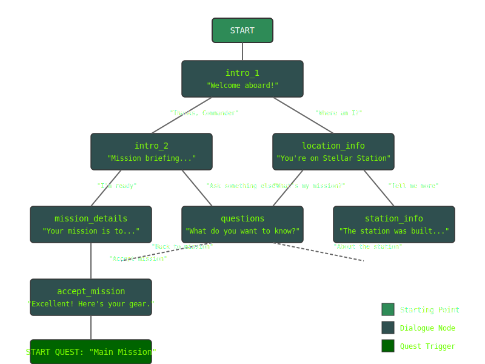

# Dialogue Tree System

A simple yet flexible system for creating, loading, and navigating text-based conversation trees with multiple UI options.

## Features

- **Core Dialogue Library**: Load JSON dialogue files, navigate between nodes, validate dialogue structure
- **Console Interface**: Text-based dialogue display with numbered responses
- **Streamlit Interface**: Web-based UI with dialogue history and interactive response buttons
- **Branching Conversations**: Create complex dialogue trees with multiple paths

## Project Understanding

- The dialogue system uses a tree structure for organizing conversations
- Each dialogue node contains text, speaker information, and possible responses
- Responses determine the path through the conversation tree
- Modular design separates core functionality from UI implementations


**sample dialogue tree**

## Getting Started

### Prerequisites

- Python 3.6 or higher
- Streamlit (for web interface only): `pip install streamlit`

### Running the Applications

1. **Console Interface**

   ```bash
   cd src
   python console_app.py
   ```

2. **Streamlit Interface**

   ```bash
   cd src
   streamlit run streamlit_app.py
   ```

## Creating Dialogue Files

Dialogue trees are defined in JSON files with the following structure:

```json
{
  "starting_dialogue": "intro_id",
  "dialogues": [
    {
      "id": "intro_id",
      "npc_name": "Character Name",
      "text": "This is what the character says.",
      "responses": [
        {
          "id": "resp_1",
          "text": "Player response option 1",
          "next_dialogue": "next_dialogue_id_1"
        },
        {
          "id": "resp_2",
          "text": "Player response option 2",
          "next_dialogue": "next_dialogue_id_2"
        }
      ]
    },
    {
      "id": "next_dialogue_id_1",
      "npc_name": "Character Name",
      "text": "Response to the first option.",
      "responses": [
        // More responses...
      ]
    }
    // More dialogue nodes...
  ]
}
```

See the example in `json/example-dialogue-json.json` for a complete dialogue tree.

## Project Structure

- `src/dialogue_lib.py`: Core dialogue management functionality
- `src/console_app.py`: Text-based console interface
- `src/streamlit_app.py`: Web-based UI built with Streamlit
- `json/`: Example dialogue files
- `docs/`: Design documents and technical specs

## Development Approach

The project follows an iterative approach:

1. **MVP Implementation** (Current Version):
   - Core library with basic functionality
   - Simple console interface
   - Basic Streamlit web interface
   - Support for branching dialogues

2. **Full Implementation** (Future Sprints):
   - Quest system tracking
   - Script commands for triggering events
   - Enhanced styling options
   - Complete dialogue history view
   - Comprehensive validation

## Development Workflow

1. **Set up the project structure** ✓
2. **Implement the core library** ✓
3. **Create the console interface** ✓
4. **Build the Streamlit interface** ✓
5. **Test with example dialogues** ✓
6. **Add advanced features**
7. **Polish UI and user experience**
8. **Comprehensive testing**

## License

This project is licensed under the MIT License - see the LICENSE file for details.
